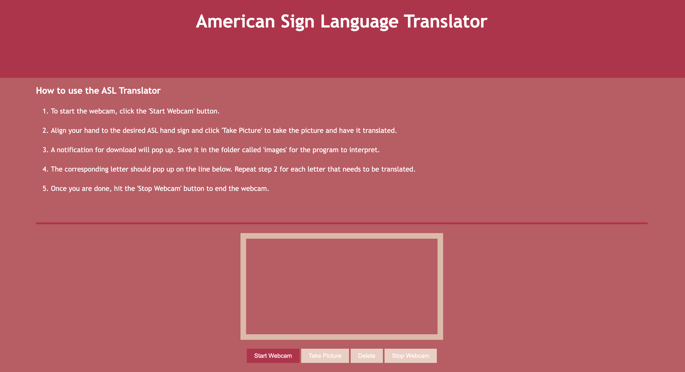

# MAIS-202-F2023-ASL-Processing

## About the Project

Basic Sign Language Translator that interprets ASL language using Machine Learning from a webcam stream and outputs the corresponding letter:

 * Uses Convolutional Neural Networks ( for now )
 * Model is trained using [Kaggle ASL Alphabet Dataset](https://www.kaggle.com/datasets/lexset/synthetic-asl-alphabet)
 * Written in Python Version 3, using PyTorch
<!--  
 ## Requirements

 Use Python Version 3  and install the following packages (tentative list):
* [PyTorch](https://pytorch.org/) and utilities, including torchvision
* [opendatasets](https://pypi.org/project/opendatasets)
* [OpenSSL] version 1.1.1 or higher or [urllib3] to 1.26.7 version pip install urllib3==1.26.7 -->

## Usage

1. Open your terminal and cd to the MAIS-202-F2023-ASL-Processing directory:

`cd path/into/MAIS-202-F2023-ASL-Processing`

2. To install all of the required packages, type the following command:

`pip install -r requirements.txt`

3. To Lauch the web application by running the following command:

`python app.py`

4. Open our website with http://localhost:0000 in our web brower.

## Dataset

<!-- Run [pytorch_version.py](https://github.com/avyan-k/MAIS-202-F2023-ASL-Processing/blob/main/src/pytorch_version.py) to load the data. Training the model will be implemented at a later time.  -->

With `get_and_split_dataset()` in `hyperpara_tuning.py` we split the dataset into training set (72%) validation set (18%) and testing set (10%)

## Choosen Hyperparameters Summary

| Hyperparameters         | Explanation                                              | Computed Result                                     |
|-------------------------|----------------------------------------------------------|-----------------------------------------------------|
| Learning Rate           | Pace the model learns the values of a parameter estimate | 0.001                                               |
| Weight Decay            | To penalizes large weights in the network                | 0.00001                                             |
| Convolutional Layers    | Number of convolutional layers in network                | 4                                                   |
| Initial Output Channels | Number of kernel in the initial convolutional layer      | 64                                                  |
| Dense Layers            | Number of linear layers after convolution                | 3                                                   |
| Neurons per Layers      | Number of neurons per dense layers                       | 1024                                                |
| Dropout                 | Number of neurons we leave out per dense layers          | 0.5                                                 |

## CNN + MLP Model Archetecture

